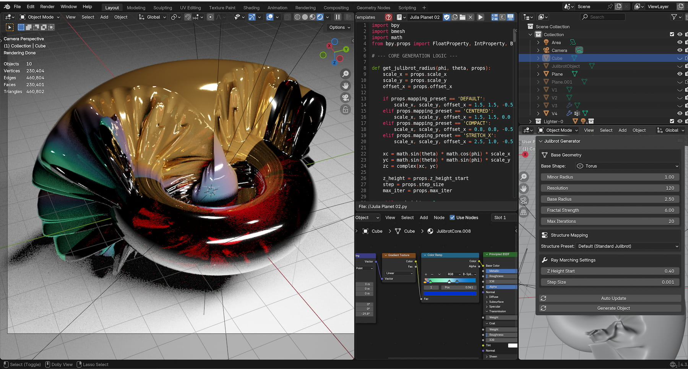
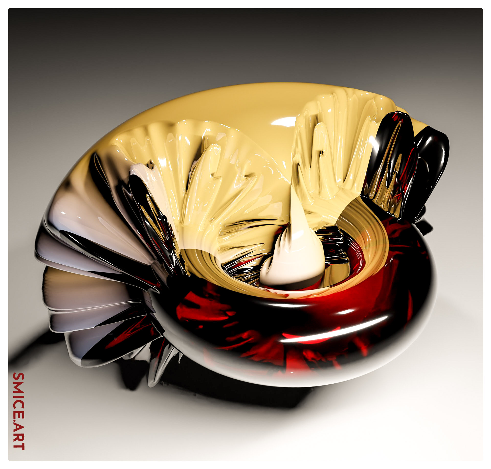
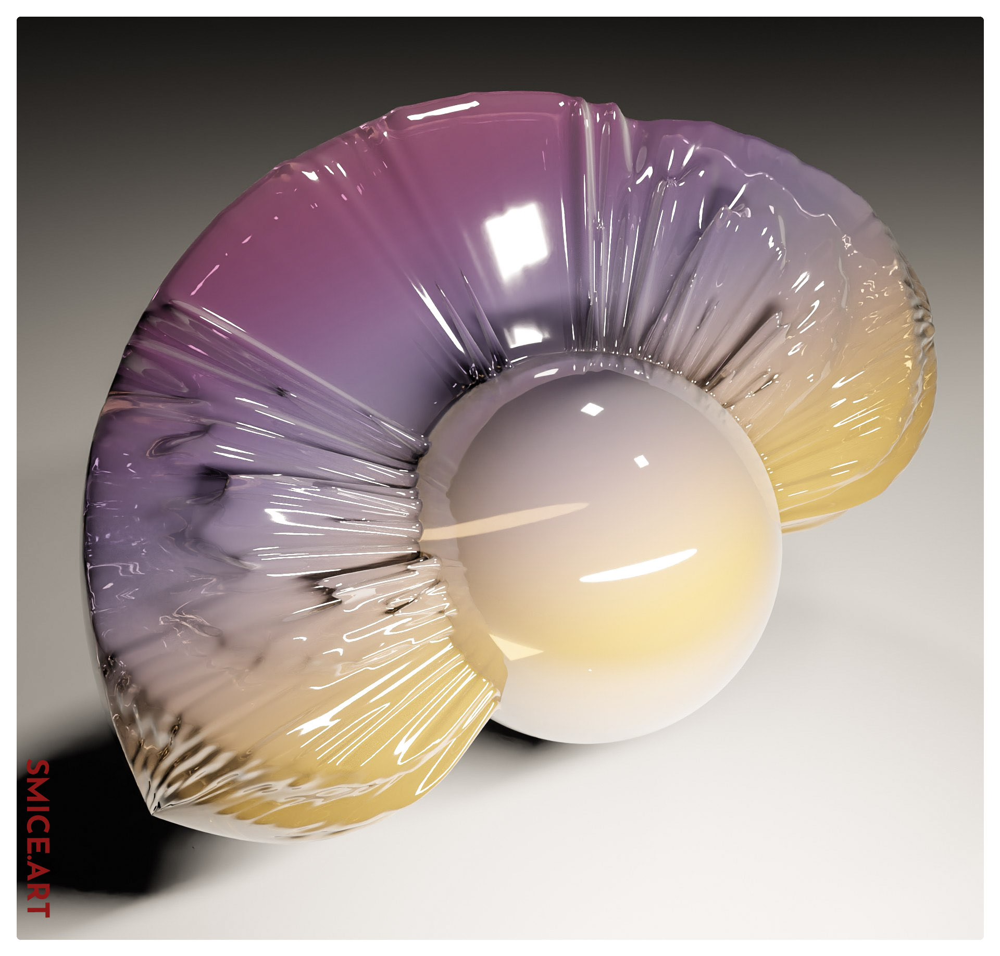
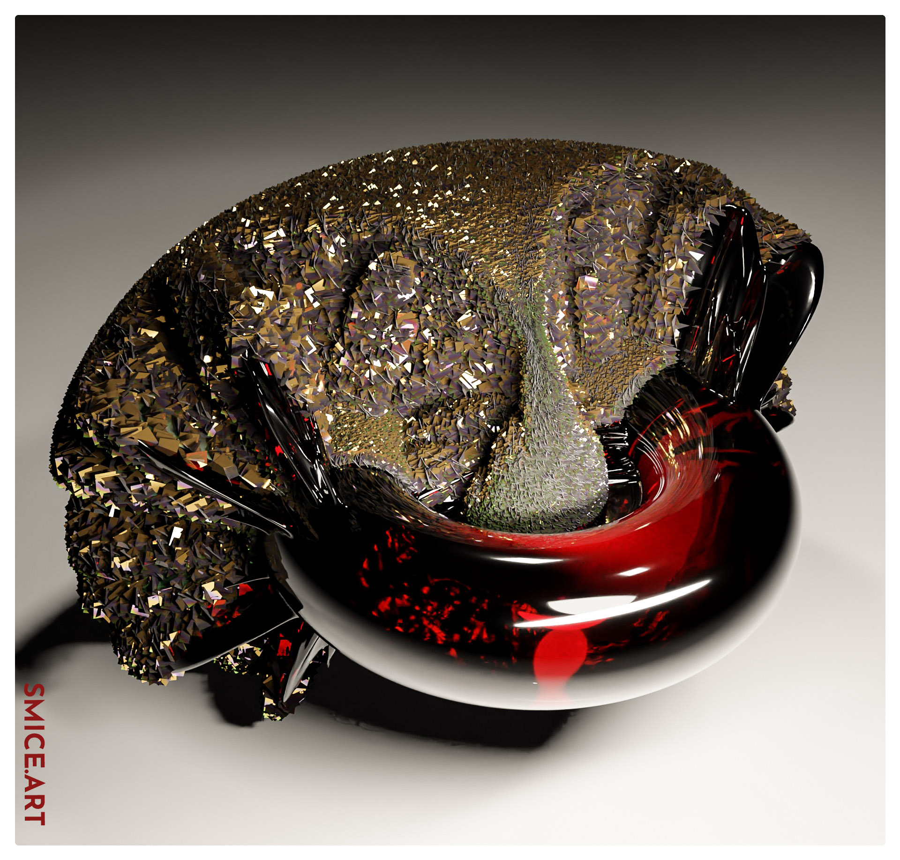
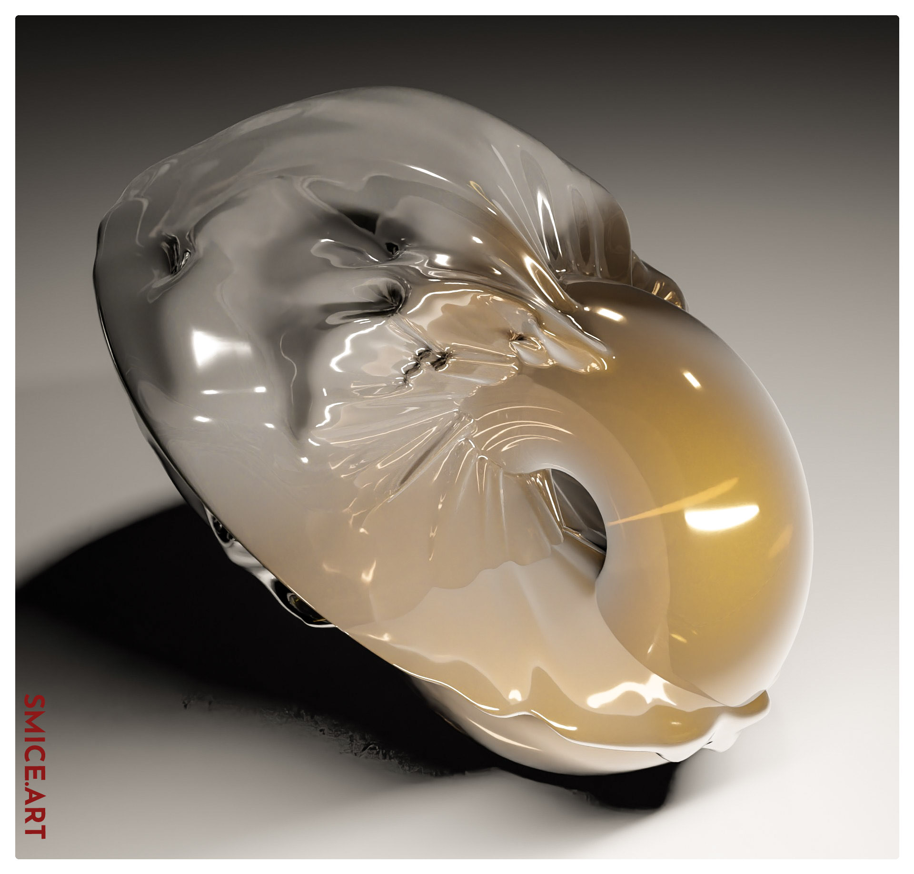
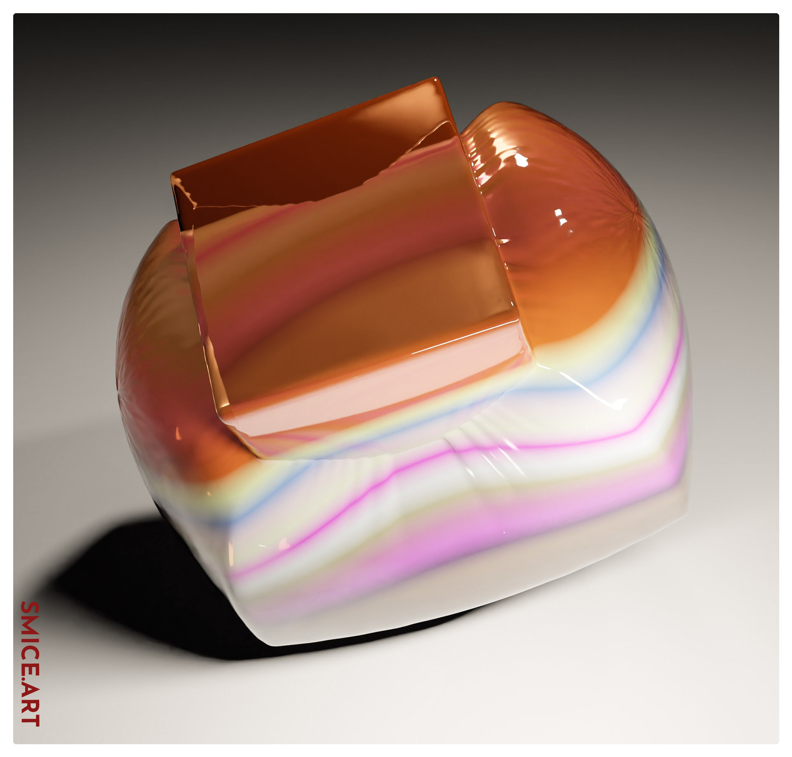
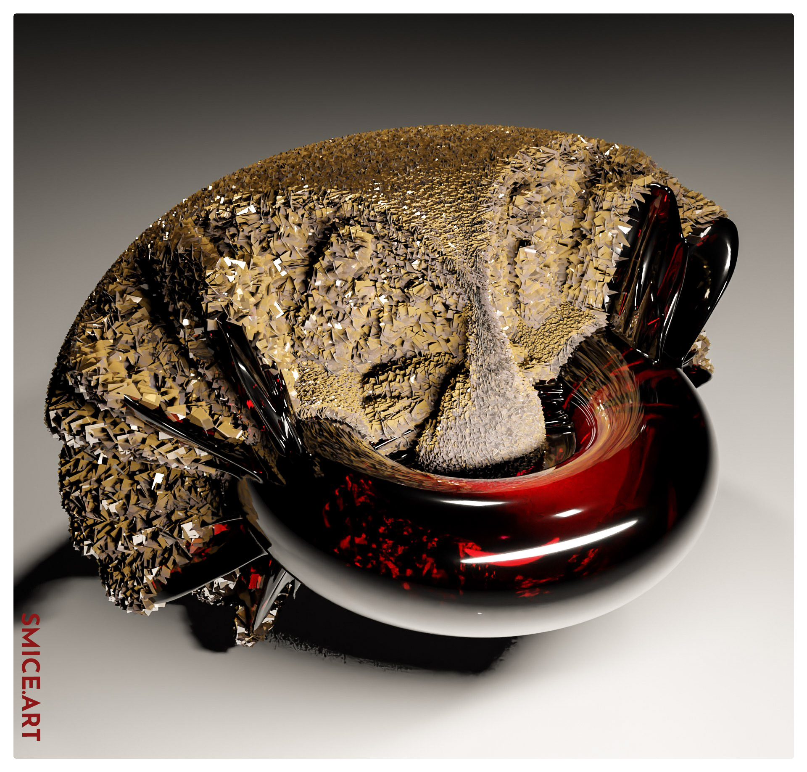

# Project Overview: 4D Julibrot space
This tool is a procedural 3D mesh generator that translates four-dimensional complex dynamical fractal boundaries into physical geometric height fields across customizable topological manifolds..

# Screen Shot

## Quick Documentation
This tool is a 3D mesh generator for Blender that turns abstract fractal equations into physical surface landscapes on shapes like spheres, cubes, and toruses.
The Core Idea; it takes classic fractal math—the infinite, self-repeating patterns famous for creating Mandelbrot structures—and wraps it around a 3D object to give it detailed, organic relief.

**How It Works
- Surface Sampling: The script projects a grid of thousands of tiny points across the target 3D shape.
- Fractal Testing: At each point, it runs a quick mathematical test to check how fast the numbers grow or "escape."
- Physical Extrusion: Points that escape faster get pushed outward to form peaks, ridges, and complex micro-structures, while stable points remain low.

** Key Features **
- Shape Switching: Allows you to swap the base geometry between a sphere, cube, torus, or flat plane.
- Pattern Tweaking: Offers visual presets and custom sliders to zoom in, stretch, or shift the fractal details across the surface.
- Real-Time Panel Controls: Sits inside Blender's sidebar with an "Auto Update" toggle so you can tweak sliders and watch the mesh update instantly.

## Previews
| Preview | Preview | Preview |
| :--- | :--- |:--- |
|  |  |  |
|  |  |  |

## Release Notes

### v1.0.0 (August 12, 2026)
- **Publishing**: First public upload of the Add-on.

## Blender

