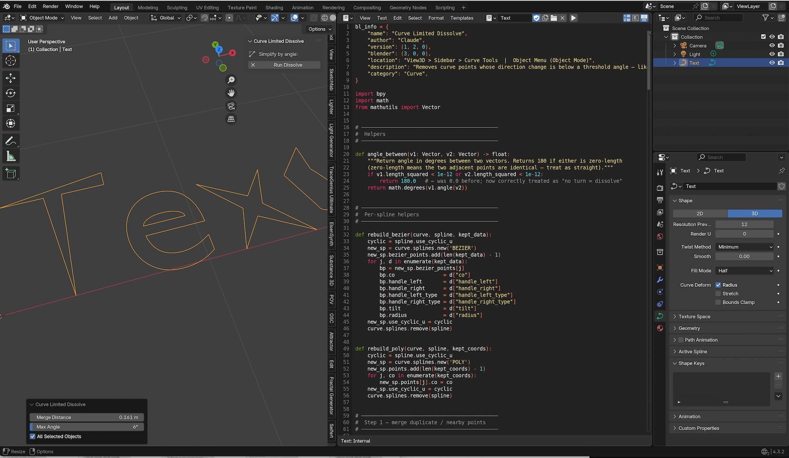

# Project Overview: Curve Disolve
Removes curve points whose direction change is below a threshold angle — like Limited Dissolve for meshes, but for Bezier/Poly curves. Also merges duplicate/overlapping points.

# Key Features

* Removes Curve Vertices in a certain Distance to each other.
* Remove Curve Vertices in a certain Angle to each other.
* Cleans up vertices of a curve as a result of a "dirty" import (f.e. svg)

# Screen Shot

## Documentation
the Add-on is easy to understand. Just open the N-Panel and play with the settings

## Release Notes

### v1.0.0 (July 27, 2026)
- **Publishing**: First public upload of the Add-on.

## Blender

