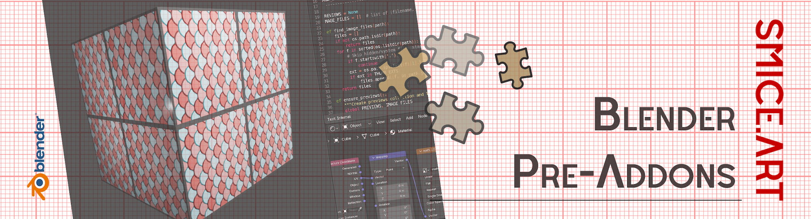
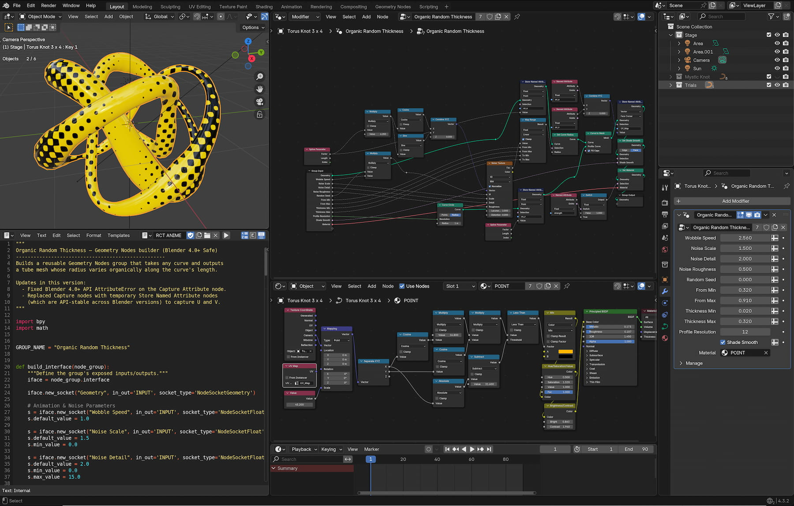
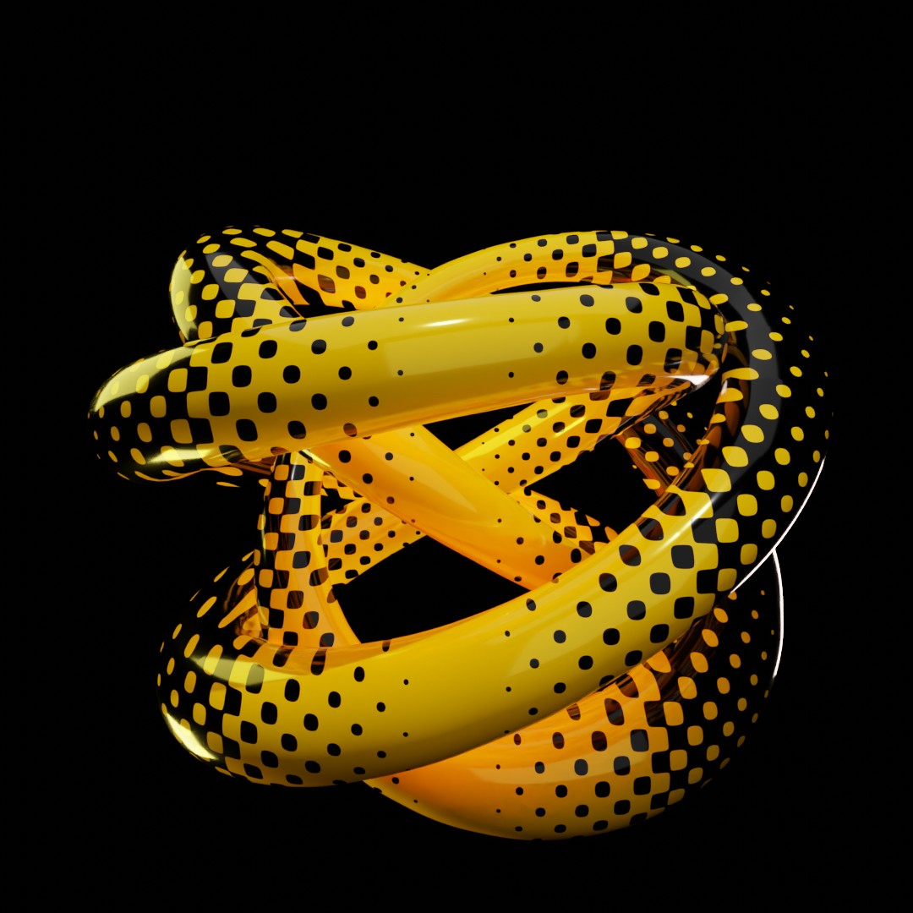
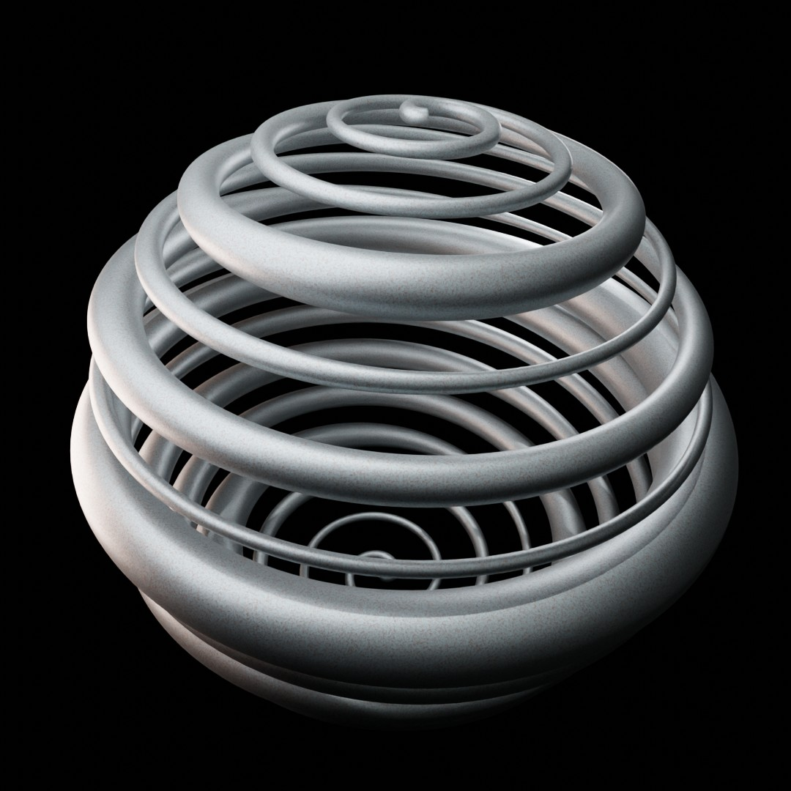

# What is this script?
Only a Tool? or already a Blender Pre-Add-On? This script is an automation tool for Blender. Instead of manually clicking and connecting dozens of nodes inside Blender's Geometry Nodes editor every time you want a specific effect, this script builds the entire setup automatically with a single click.

# What does the generated tool do?
Once you run the script on a curve (like a circle or a drawn path), it adds a custom modifier to your object that transforms a simple flat line into a 3D organic tube or cable with several advanced features:
* Organic Thickness Control: It uses procedural noise to make the tube dynamically swell and thin out naturally along its length, rather than staying a uniform size.
* Seamless, Loopable Animation: It features a built-in "wobble" effect that animates smoothly over time. Because of how the coordinates are mapped in a continuous circle, the animation loops perfectly without a jarring beginning or end.
* Built-in UV Mapping: It automatically calculates and stores custom UV coordinates (UV_Map) across the mesh. This ensures that any texture or image shader you apply wraps cleanly around the tube without stretching or visible seams.
* Artist-Friendly Controls: It exposes a clean set of sliders right in the Blender modifier panel—such as Wobble Speed, Noise Scale, Thickness Min/Max, and Material slots—allowing artists to tweak the look visually without ever looking at code or nodes.
* Smart Preparation: It automatically checks if your curve is set to Bézier (for smooth curves) and fixes it if it isn't, ensuring it always looks great right out of the box.

## Screen Shot

## Run
* Paste in your Script Editor
* Press Run

| Object | Preview |
| :--- | :--- |
|  |  |

## Yarn Ball Menu

## Notes
⚠️ The proper UV Settings are depending on your chosen material, you have to play in the shader settings like in shown in the screenshot

### v1.0.0 (August 6, 2026)
- **Publishing**: First public upload of the Add-on.

## Blender

