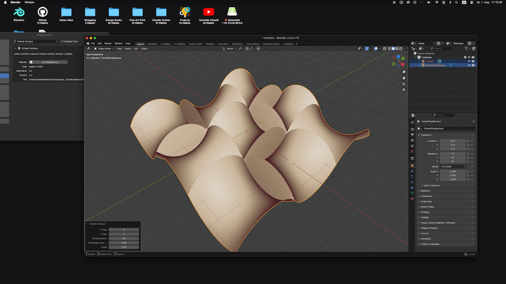

# Project Overview: First Scherk
The first Scherk surface is the only minimal surface that is a translation surface. It is obtained by translation of the curve of the log cosine (which is also the catenary of equal strength) along itself. This tiny add-on adds a mesh menu entry to generate the first scherk surface Array-Like in your workspace.

## Installation

1. Download the py script "First-Scherk.py"
2. In Blender, go to **Edit > Preferences > Get Extensions**.
3. Click the dropdown in the top right and select **Install from Disk**.
4. Select your `First-Scherk.py` file.

## Screen Shot

## Documentation
The Add-on is easy to understand, after installing via "Preferences" there is a entry unter "Add Mesh" called "Scherk"

| Object |
| :--- | 
|  | 

## Release Notes

### v1.0.0 (August 01, 2026)
- **Publishing**: First public upload of the Add-on.

## Blender

