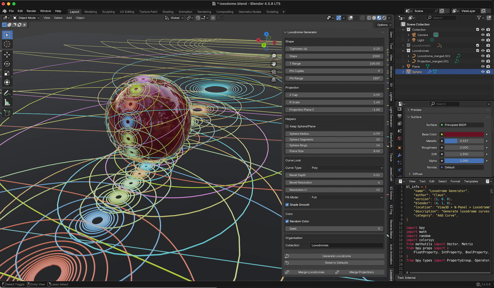

# Project Overview: Loxodrome Generator
The project is a custom Blender 3D Python add-on called Loxodrome Generator. It is ready to run as add-on. 

# Key Features

Loxodrome Generator creates a family of loxodrome (rhumb line) curves distributed around a sphere and their corresponding stereographic projections onto a flat plane below. Each curve is built as a native Blender curve object — complete with adjustable bevel thickness, resolution, and fill mode — rather than a static mesh, so it stays fully editable after generation. All geometric parameters (spiral tightness, point density, number and angular spread of rotated copies, projection scaling) are exposed in a dedicated N-panel, along with helper-object settings, a random-color mode that assigns each curve pair a distinct vivid hue, a one-click reset to defaults, and dedicated buttons to merge all loxodrome curves — or all projection curves — into a single combined object once the result looks right.

# Screen Shot

## Documentation
the Add-on is easy to understand. Just open the N-Panel and play with the settings. Version _3 merges the curves to a single color. Version _4, keeps the colors for each curve separately.

## Release Notes

### v1.0.0 (July 27, 2026)
- **Publishing**: First public upload of the Add-on.

## Blender

