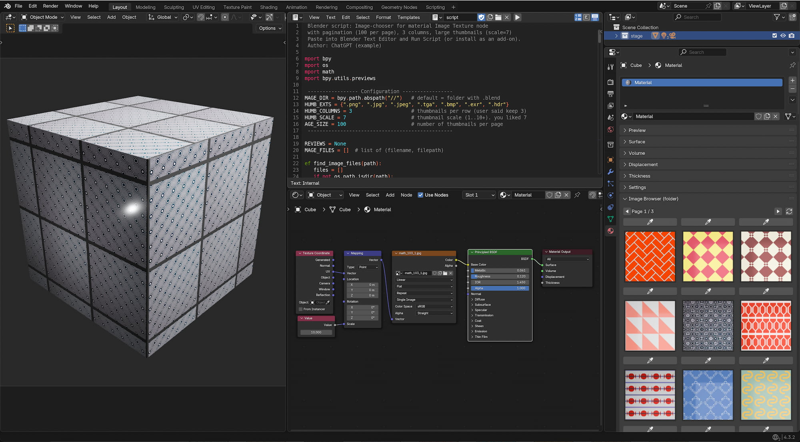

# Python Scripts Material Checker
A small "pre" add-on to switch easy and quick between hundreds of materials.

## The Why
The idea behind this add-on was to create the possibility of reactivating the original material properties from a baked material texture, or at least in the form of an approximation of the original definition of the original material.

## Quick Start
Open the zip file, store it in you files system and open the Blend.File "material shader.blend" (Blender version 4.3), than press play and let the script run. I added many example files from a math-shader projct on Superhive: (https://superhivemarket.com/products/1000-procedural-math-blender-materials). If you like your own image database, just rcopy the blend.file to your desired directory and run the script again.

## Video Tutorial
This short video tutorial is a small instruction.

## Release Notes

### v1.0.0 (July 25, 2026)
- **Publishing**: First public upload of the Add-on.
