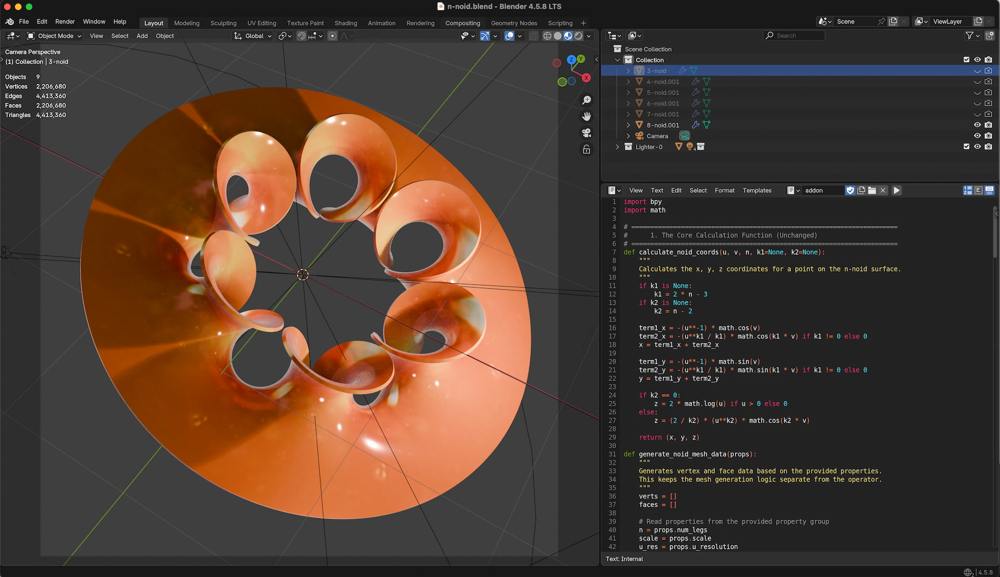
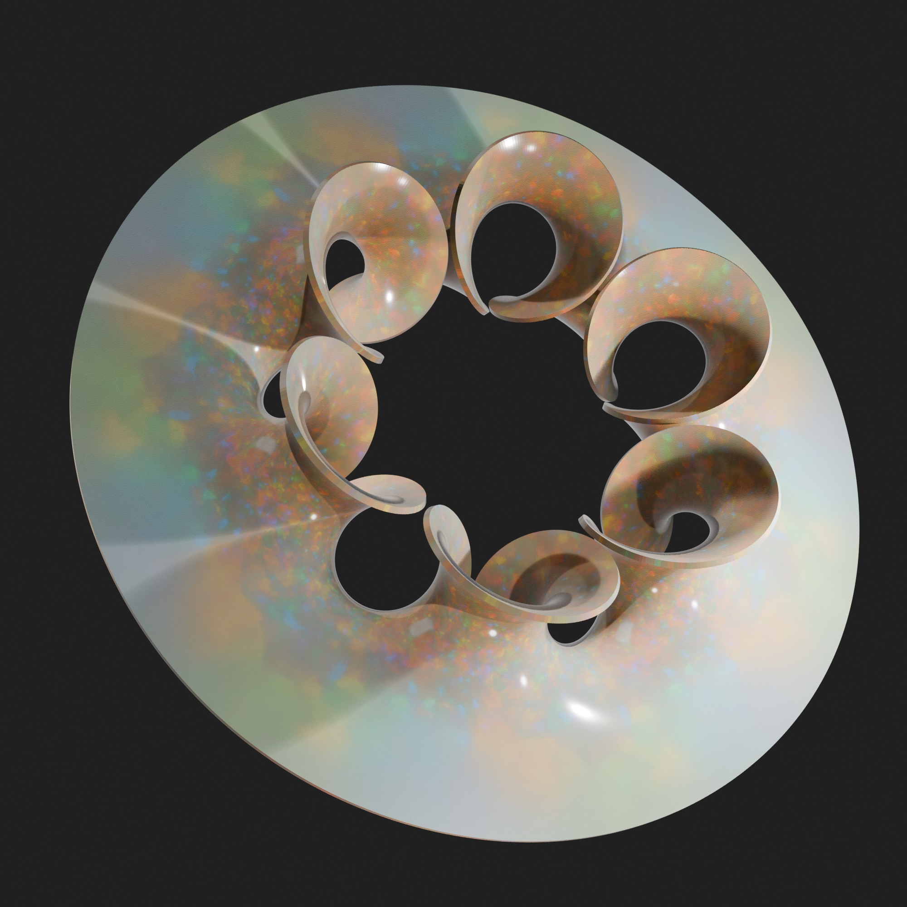
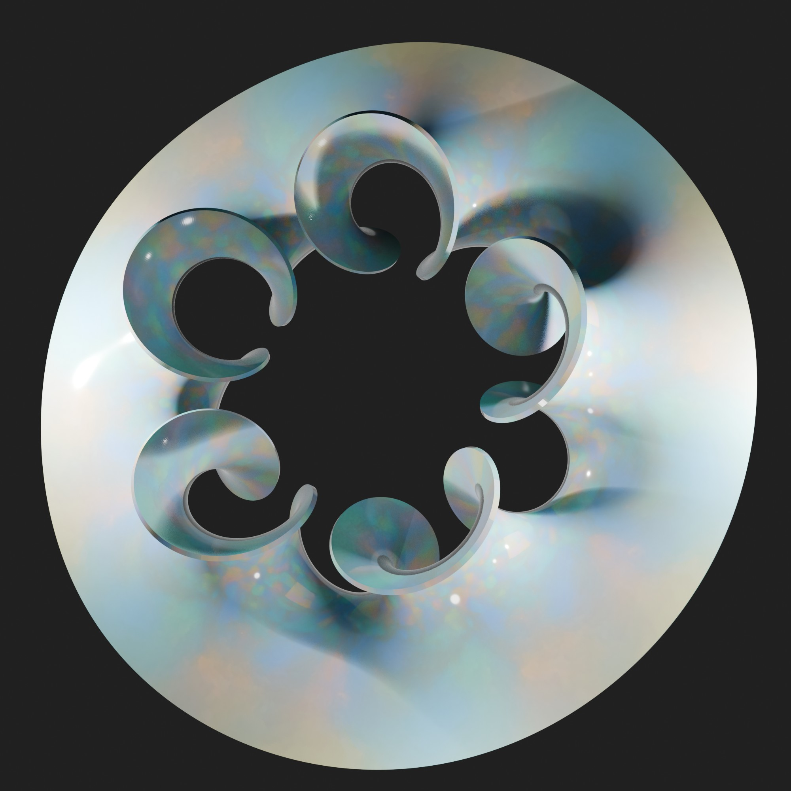
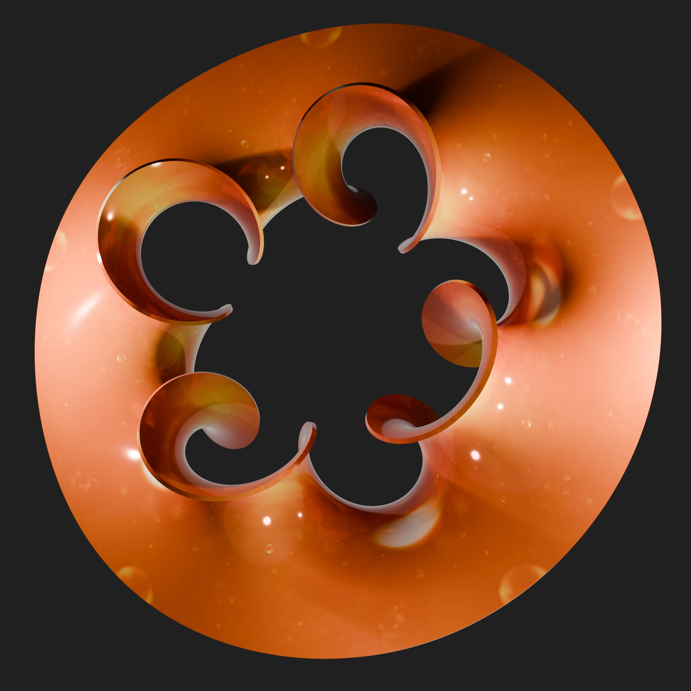
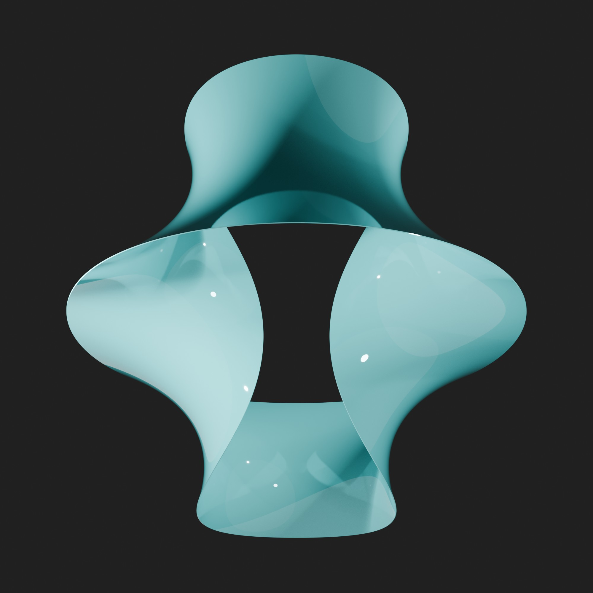

# Info ⚠️
Please excuse me regarding the correct mathematical terms; I am unfortunately not a mathematician, so they are sometimes certainly not correct.

# N-Noid Surfaces
This is a Blender Add-on to generate a N-Noid minimal surface. It adds a panel to the 3D View's "N-Panel" (side panel). 

# Screen Shot

## Install or Run
you don´t have to make a add-on - to run it just paste the certain script in the blender script editor and press run. all variants have a n-panel entry.

## The Background
When I tired to develop an add-on  to generate n-noid minimal surfaces, I found that I have not enough skills and understanding to do it by my own. Same as before with the K-Noids. So I asked ChatGpt & co for help. The idea behind this add-on was to create a simple way to create n-noid mathematic minimal surface. 
You find the main "add-on" script (it is a pre-add-on) that can run as usual in the Blender script editor. But also you find two variations, one from chatGpt, one in a V1 of the later add-on. 

Only the first one [n_noid_creator_panel V2.py] is really nice, but the others are interesting as well.

## Views
| Image | N(Legs) | Scale | U-Min | U-Max | Resolution U/V | K Values 1/2 |
| :--- | :--- | :--- | :--- | :--- | :--- |  
|  | 7 | 0.7 | 0.49 | 1.11 | 200/200 | 13/6 |
|  | 7 | 0.7 | 0.49 | 1.11 | 200/200 | 11/5 |
|  | 6 | 0.7 | 0.46 | 1.14 | 200/200 | 9/4 |
|  | 5 | 0.7 | 0.46 | 1.17 | 200/200 | 7/3 |
|  | 4 | 0.7 | 0.49 | 1.23 | 200/200 | 5/2 |
|  | 3 | 0.7 | 0.43 | 1.17 | 200/200 | 3/1 |

## Release Notes

### v1.0.0 (July 31, 2026)
- **Publishing**: First public upload of the Add-on.

## Blender

