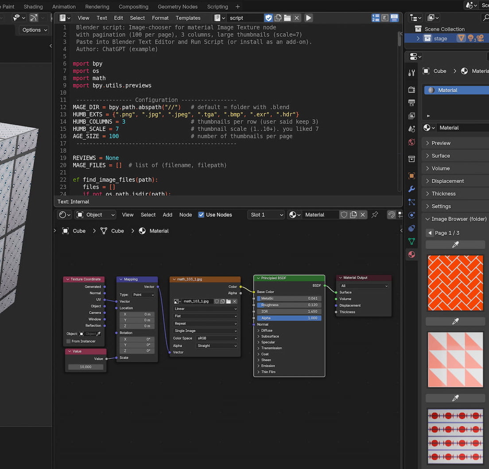
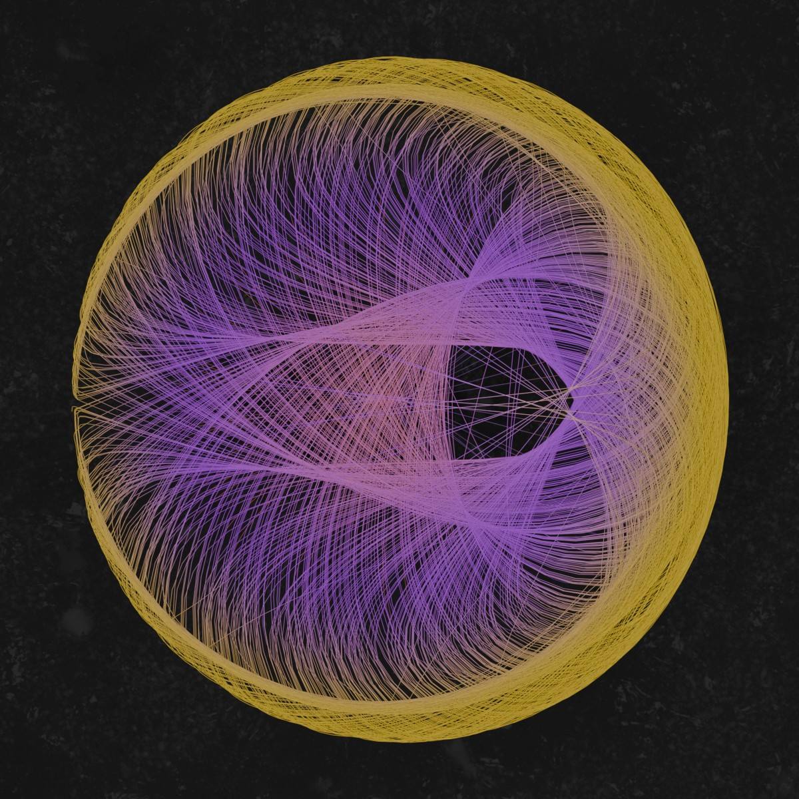
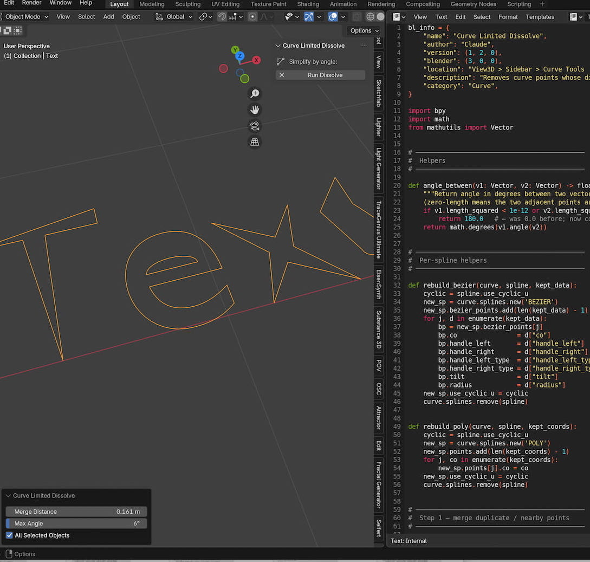
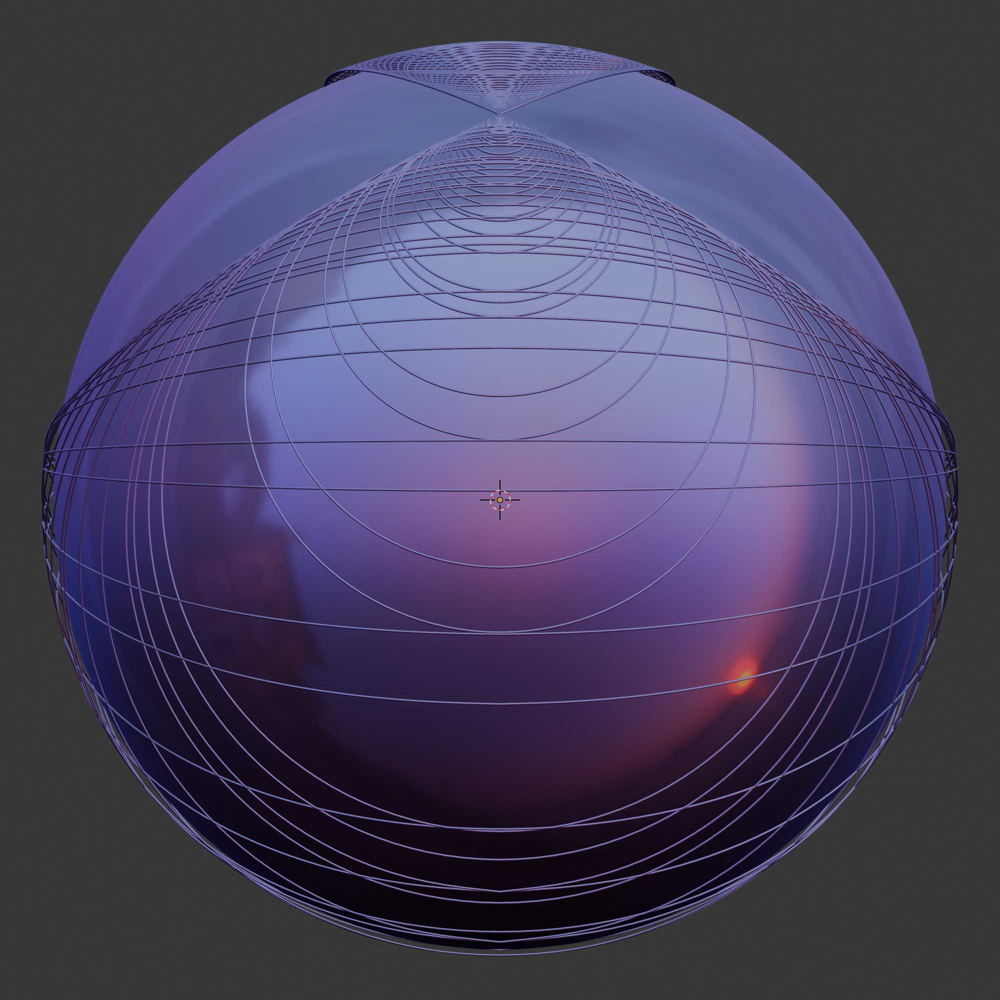
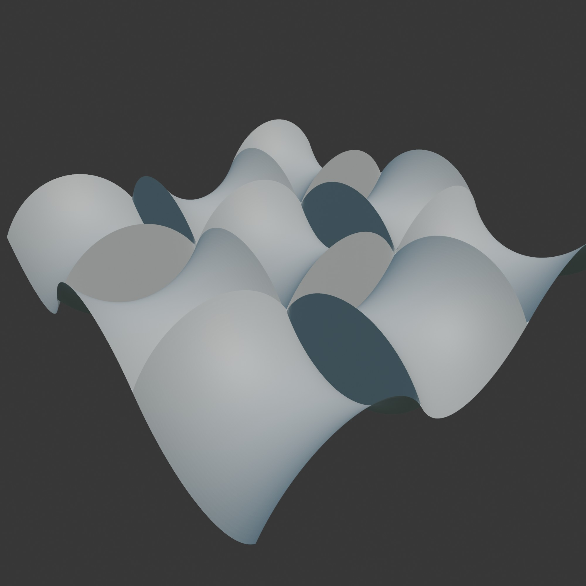

  

# Blender "pre-add-ons"
A collection of scripts that could already run as add-on, but are not released or finalized now.

# What those addons do?
Those add-ons are still under development, some are completely ready, some are still in development. Some might have no further development, but are open to continue by someone else.

## Installation
Note: Please download the files located under each assets section of the latest releases page, or their "Download ZIP" button on the main page.

## Documentation
There is no explicit documentation on this scripts.
Here is the table of Blender Scripts with a small preview:

| Object | Description | Preview |
| :--- | :--- | :--- |
| **[MATERIAL](./MaterialChecker/)** | this add-on enables a very quick change of materials . |  | 
| **[CHAOS](./ChaosSymmetry/)** | a add-on to build chaos attractors. |  | 
| **[CLEANCURVES](./CurveDisolve/)** | a add-on to clean up unused vertices of a curve. |  | 
| **[LOXODROME](./LoxodromeGenerator/)** | build Loxodrome object and their sterographic projections. |  | 
| **[YARNBALL](./YarnBall/)** | Yarn Ball generator -- interactive add-on version. |  | 
| **[N-NOIDS](./N-NoidGenerator/)** | Minimal Surface generator -- a "Pre" add-on version without the add-on header. |  | 
| **[FIRST_SCHERK](./FirstScherk/)** | A "First Scherk" Surface generator -- a "mini" add-on to add a menu entry. |  | 
| **[SCHERKCOLLIN](./Second-Scherk-Sculpture/)** | the "Second Scherk" Surface generator/ and Scherk-Collin Surface builder . |  | 

## Release Notes

### v1.0.0 (July 20, 2026)
- **Publishing**: First public upload of the Add-on.
