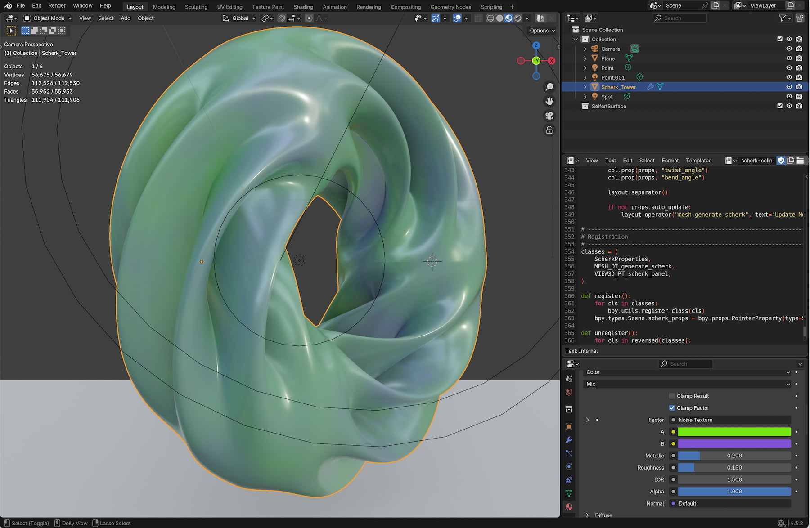
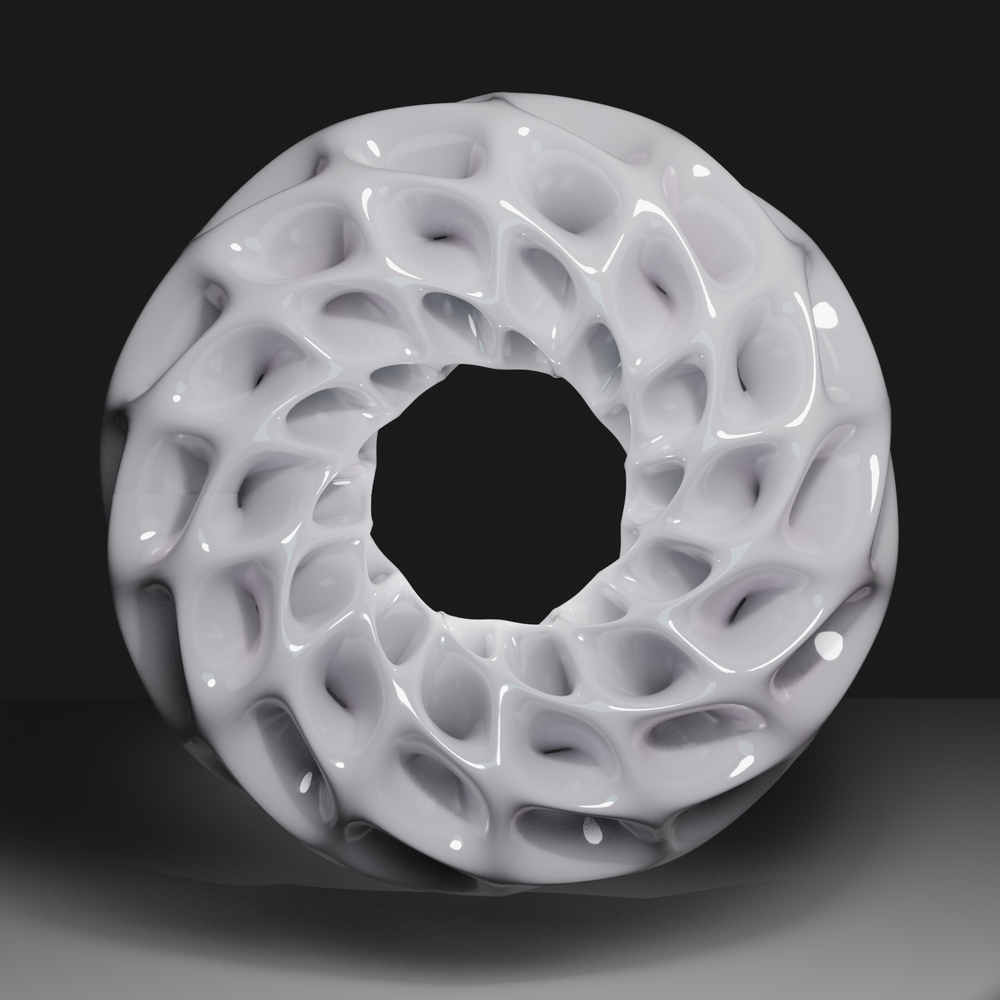
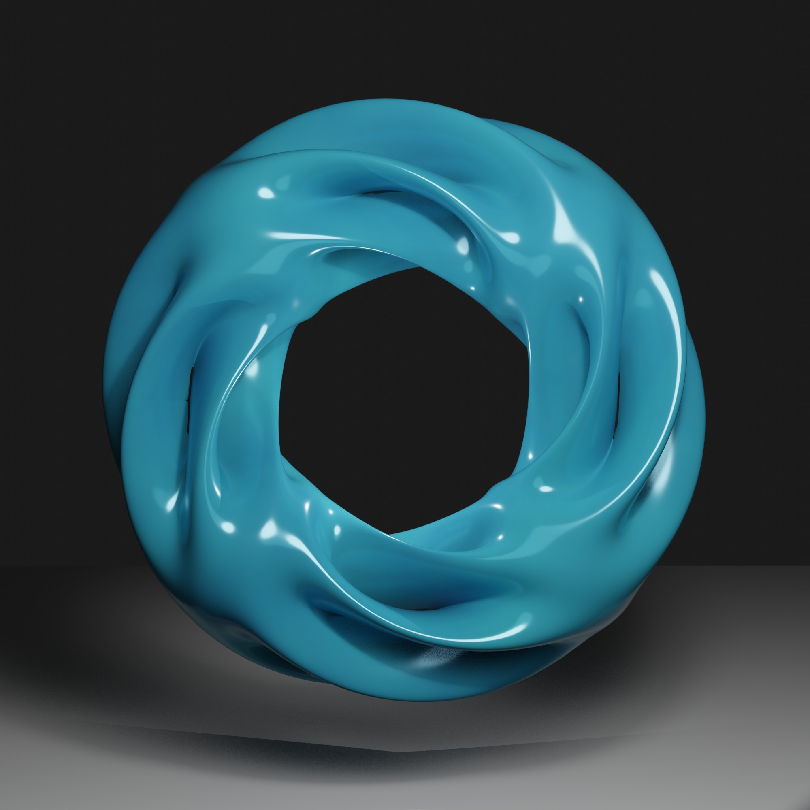
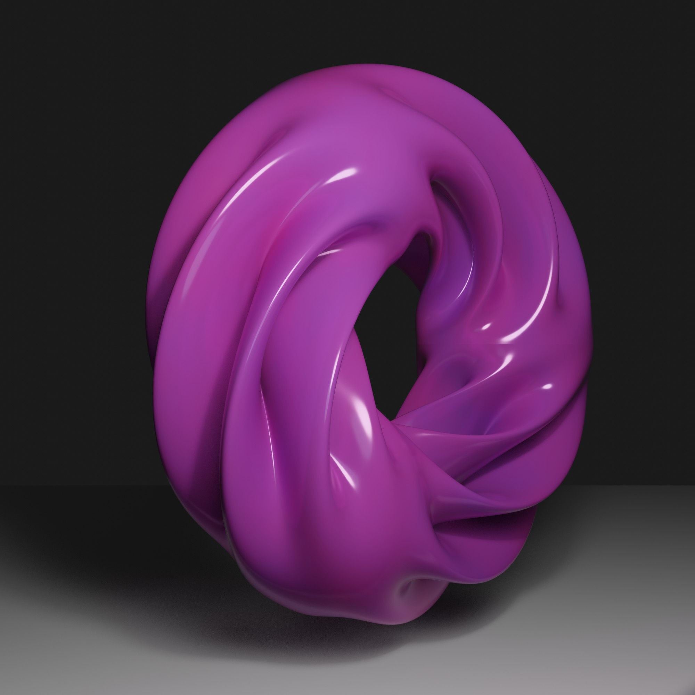
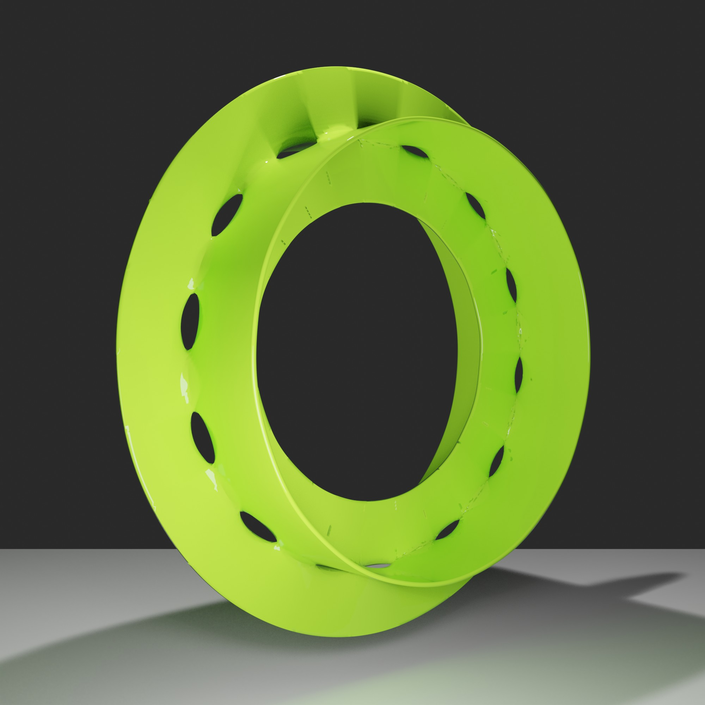
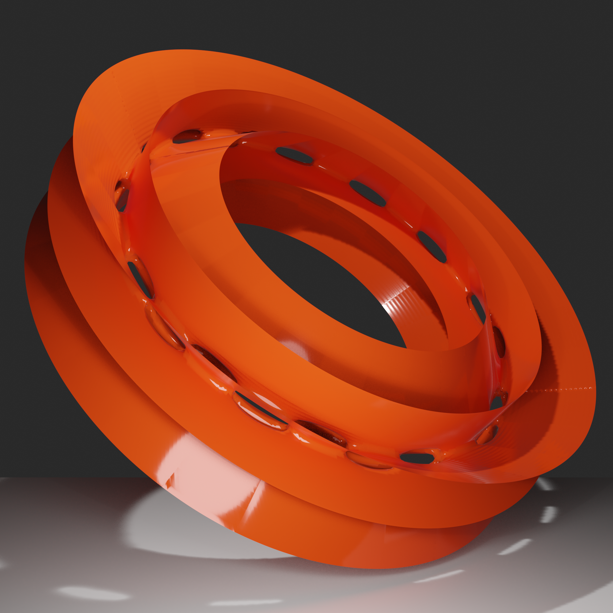
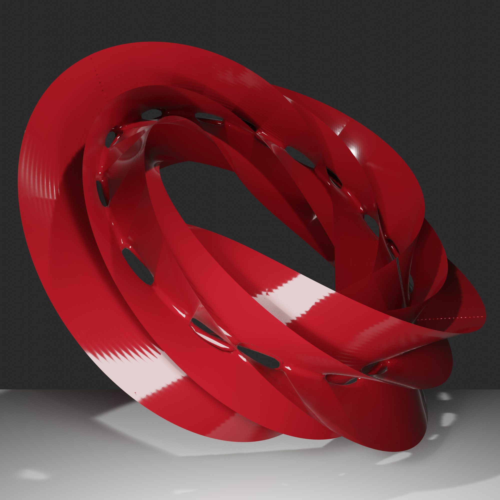
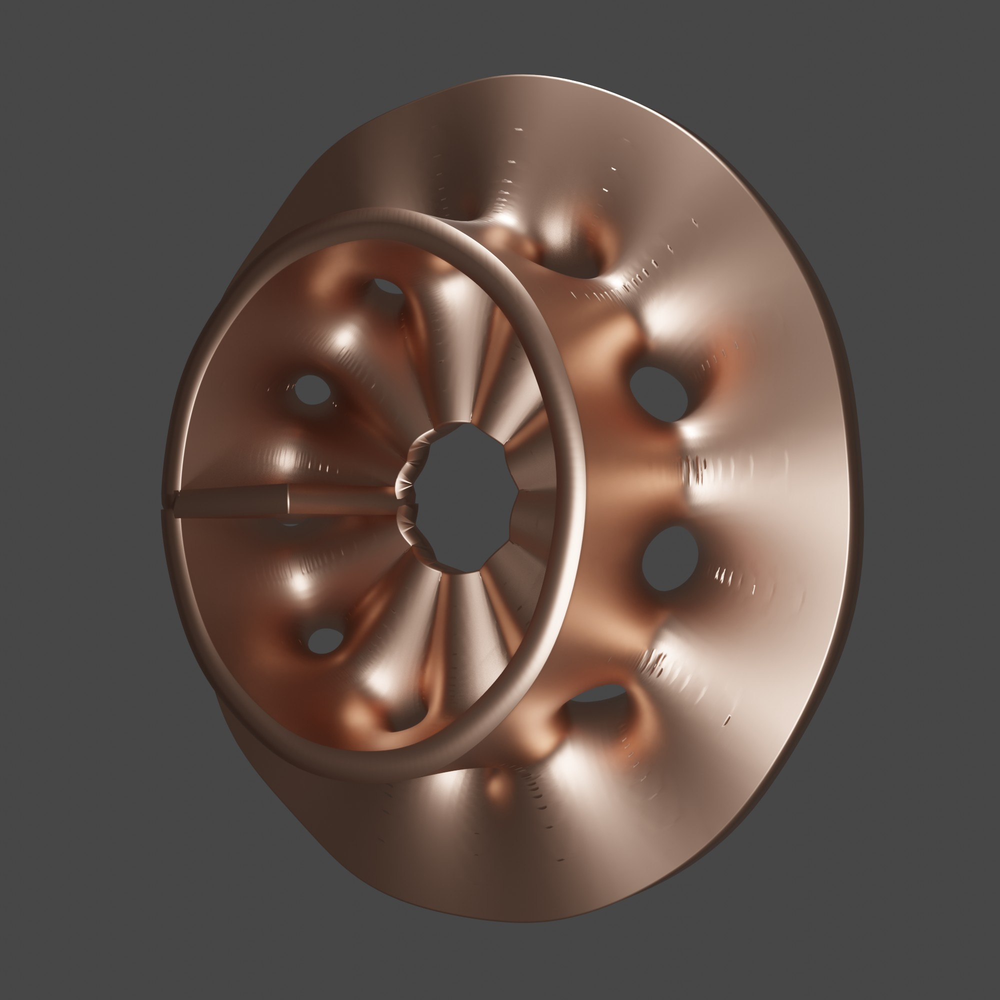
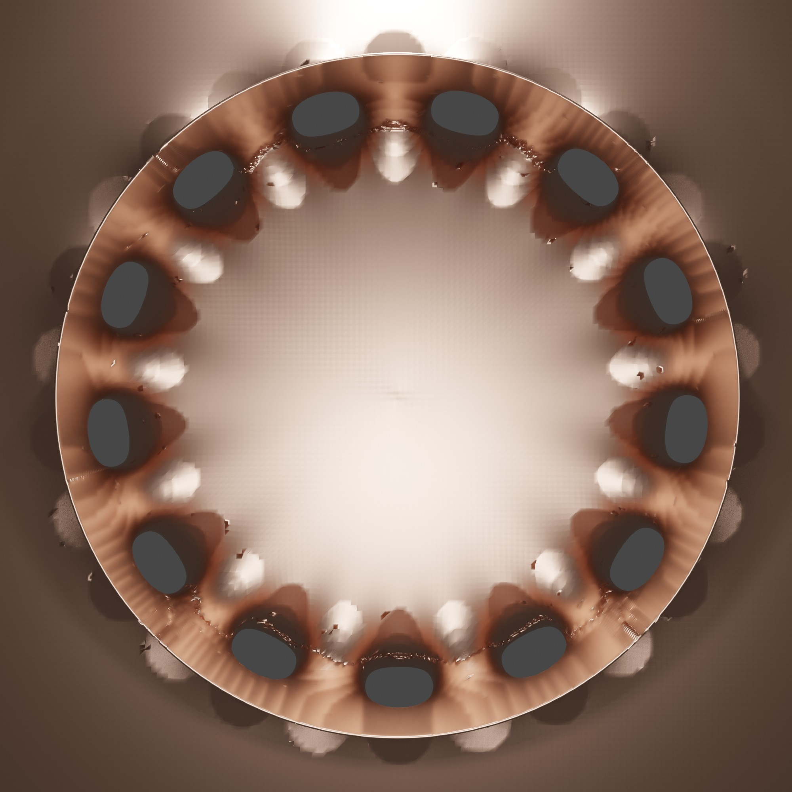

# Info ⚠️
Please excuse me regarding the correct mathematical terms; I am unfortunately not a mathematician, so they are sometimes certainly not correct.

# Scherk, Scherk Collin Surface Generator
This is a Blender Add-on to generate Scherk Collin Surface

# Screen Shot

## Install or Run
you don´t have to make a add-on - to run it just paste the certain script in the blender script editor and press run. all variants have a n-panel entry.

## Views
| Image | N(Legs) | 
| :--- | :--- |
|  | Gemini Smooth 1 |
|  | Gemini Smooth 2 |
|  | Gemini Smooth 3 |
|  | Claude Add-on 1 |
|  | Claude Add-on 2 |
|  | Claude Add-on 3 |
|  | Geometry Nodes |
|  | Qwen Variation |

## Release Notes

### v1.0.0 (July 31, 2026)
- **Publishing**: First public upload of the Add-on.

## Blender

