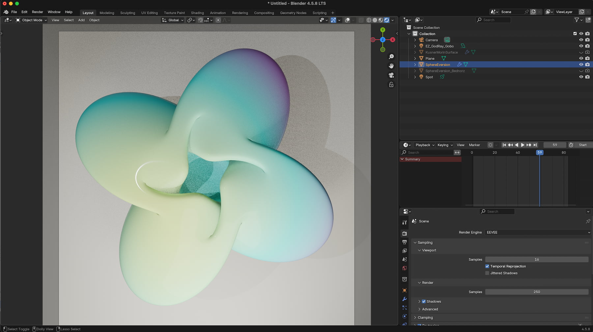
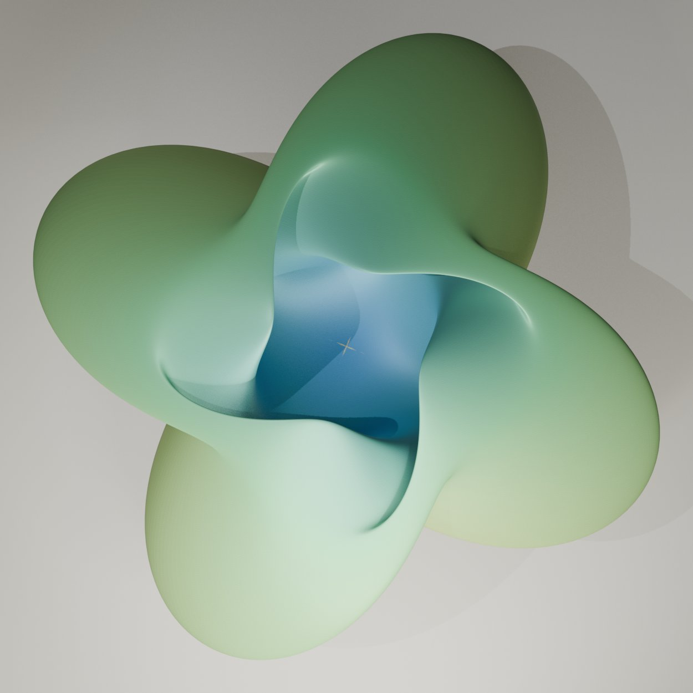
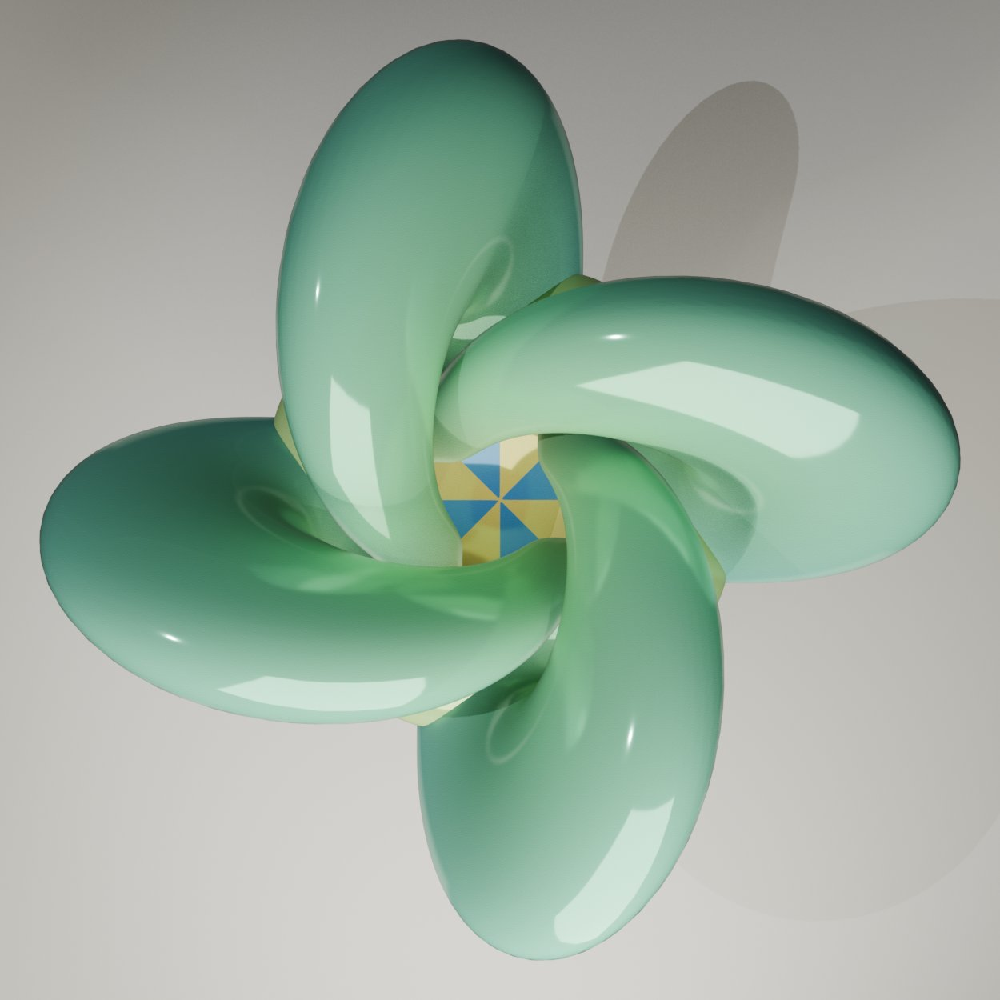
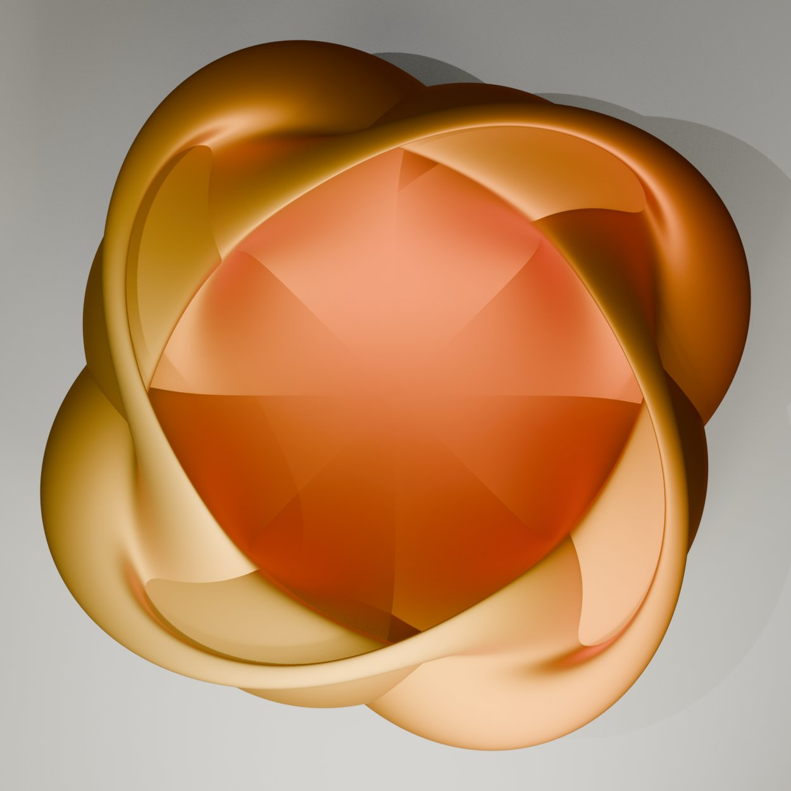
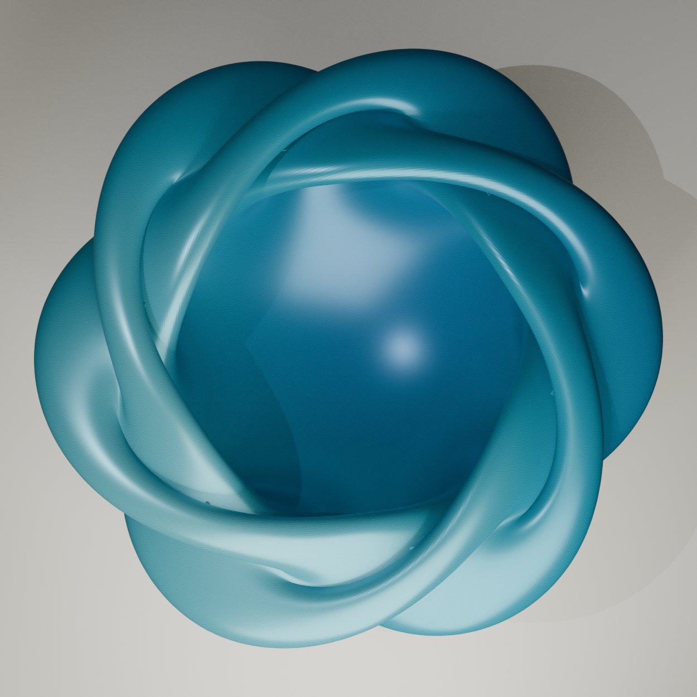
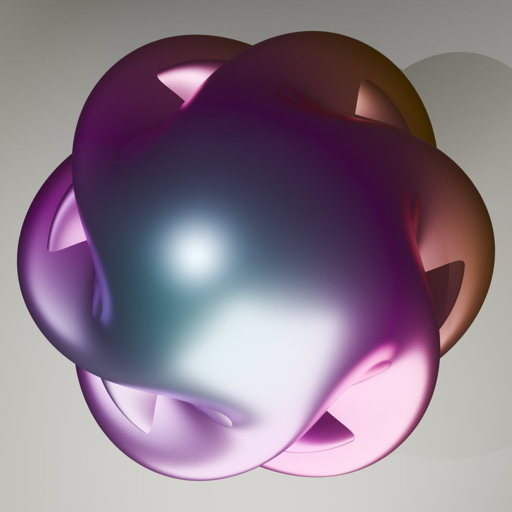
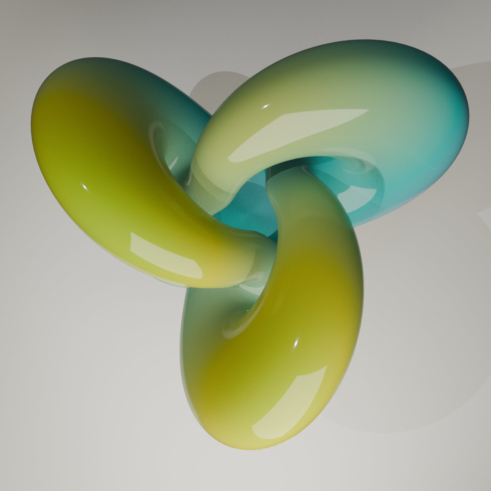
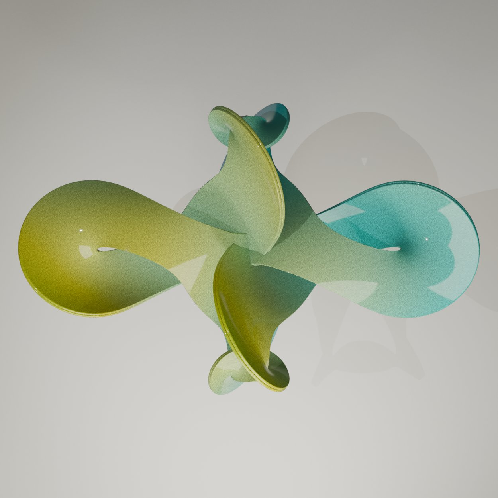

# Project Overview: Sphere eversion Blender addon
Sphere eversion is the mathematical process of turning a sphere inside out in three-dimensional space. It can be done smoothly and continuously without cutting, tearing, or creating sharp creases, provided the surface is allowed to pass through itself via self-intersections.

# Screen Shot

## Quick Documentation
There a two script version of the Addon, both with a animation function, but the are both with different focus.

N-panel tab "Eversion"

- Progress slider (0=sphere, 0.5=halfway model, 1=inside-out) + quick-jump buttons
- Shape: arm count n (2 = the 4-armed quadrifolium look in your image; 3 = Boy-surface variant)
- Q (twist range), radius scale
- Resolution & Precision: ring/segment counts, plus the two epsilon clamps needed for the removable singularities at the poles and at the wormhole-inversion phase boundary (same spirit as the pole handling in your Wente torus addon)
- Appearance: vertex-color latitude gradient (blue→green→yellow, baked as a Color Attribute + Principled BSDF) plus a wireframe-overlay toggle to get that gridded look from the poster
- Animation: frame-change handler that drives Progress from the timeline (matches your spherical-harmonic addon's pattern), plus a bake operator

## Previews
| Preview | Preview | Preview |
| :--- | :--- |:--- |
|  |  |  |
|  |  |  |

## Version II

## Release Notes

### v1.0.0 (August 16, 2026)
- **Publishing**: First public upload of the Add-on.

## Blender

