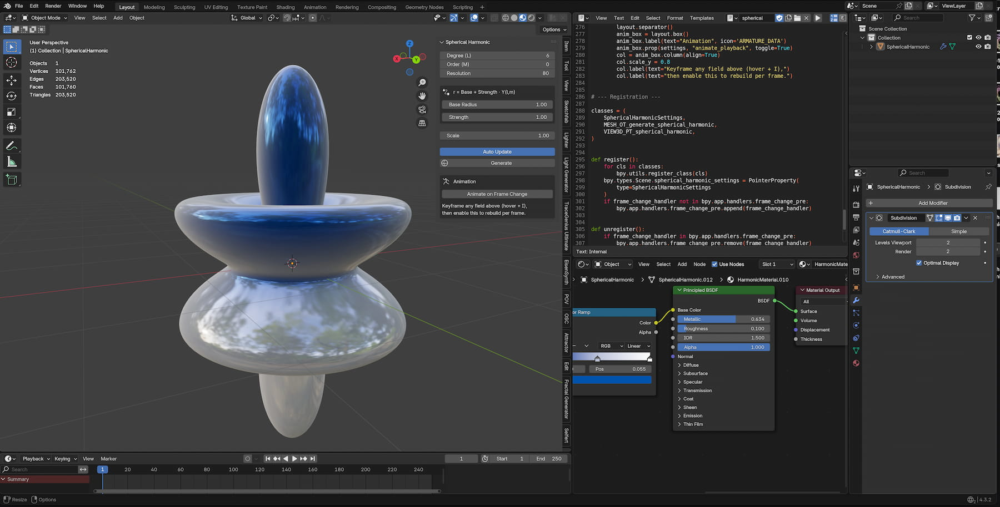
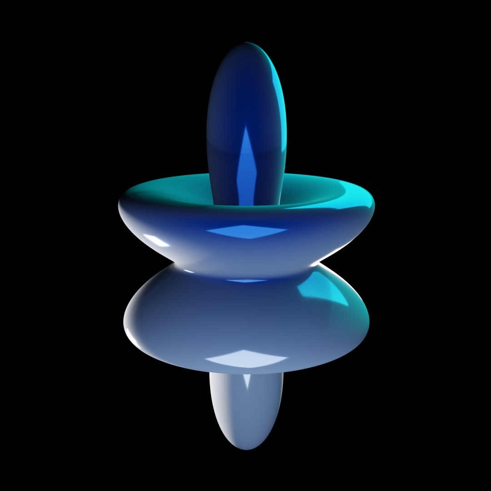
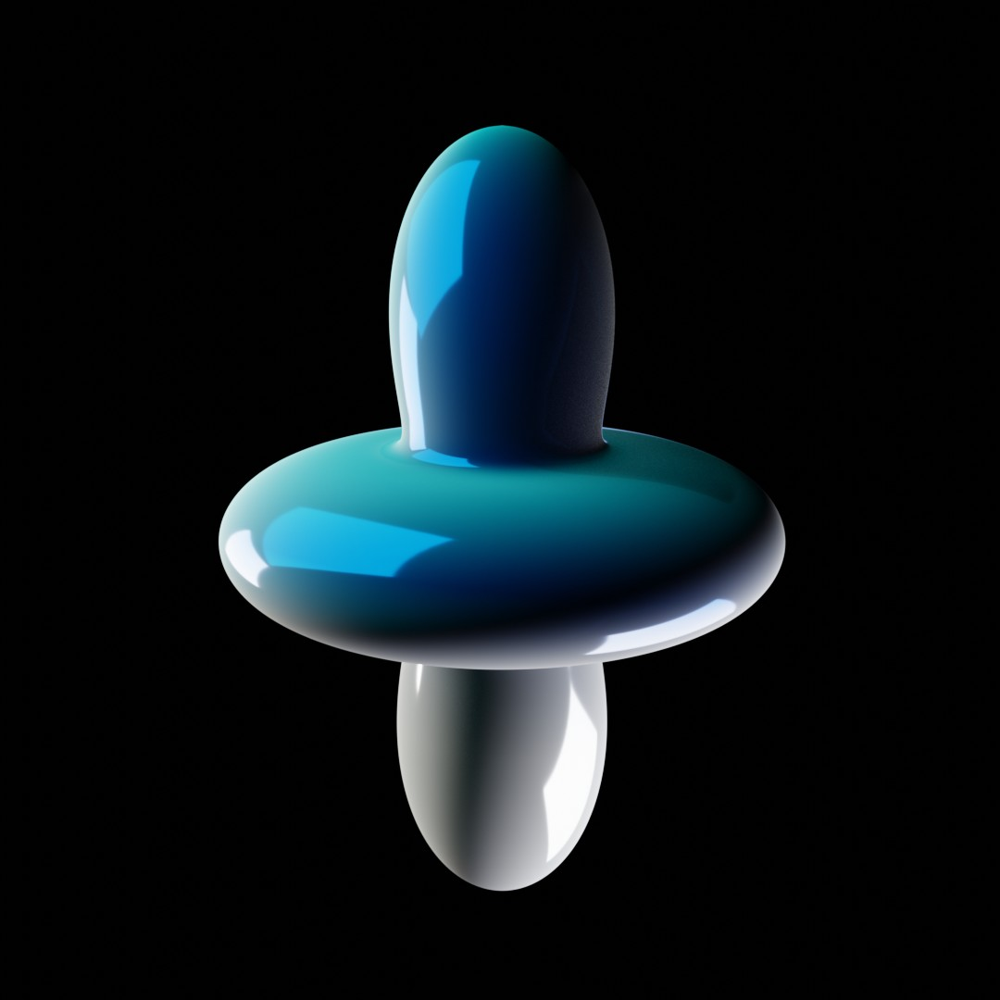
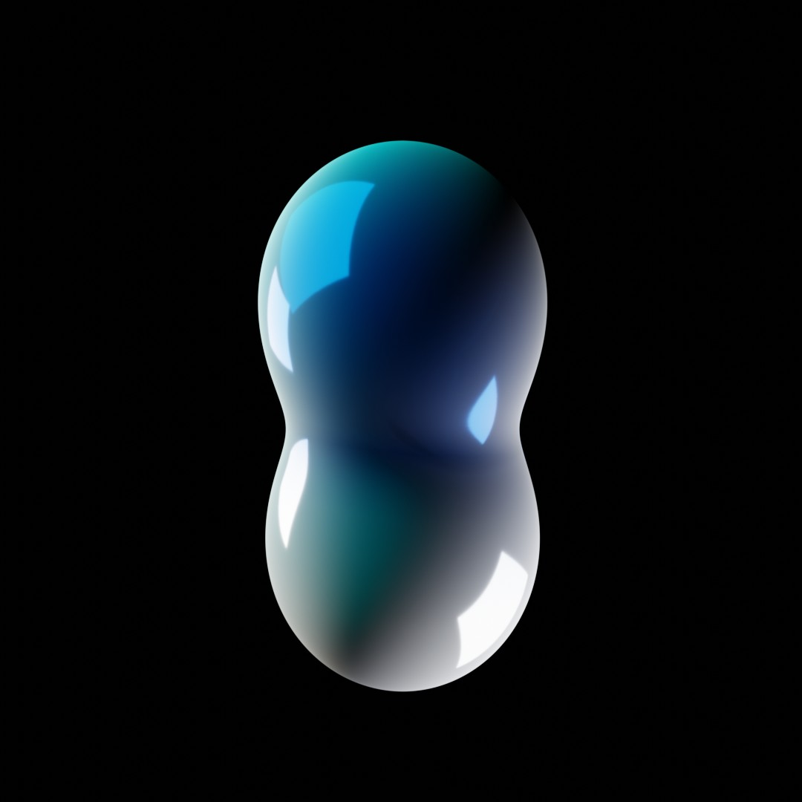
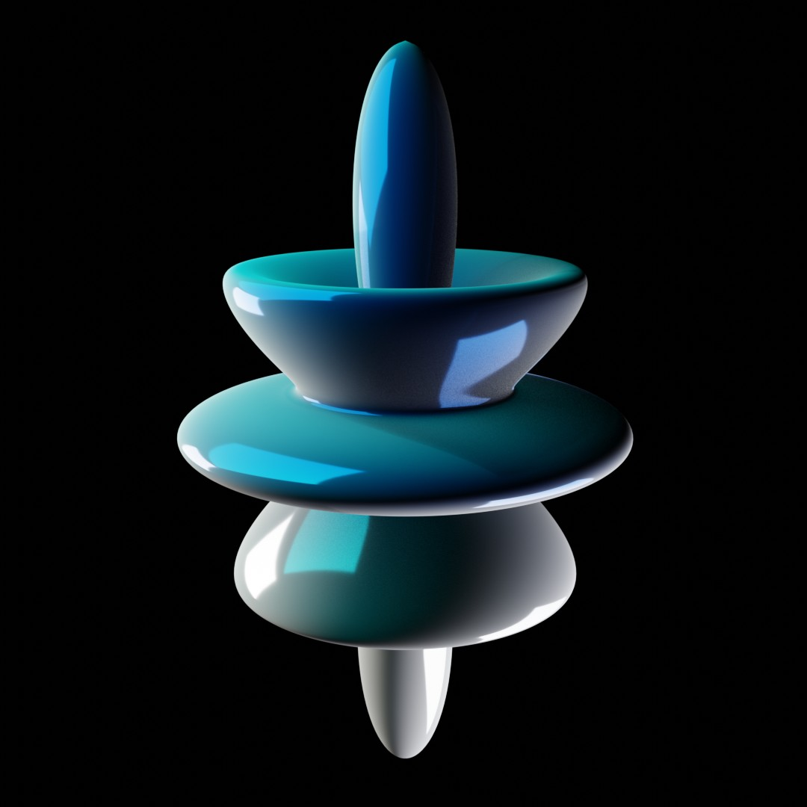
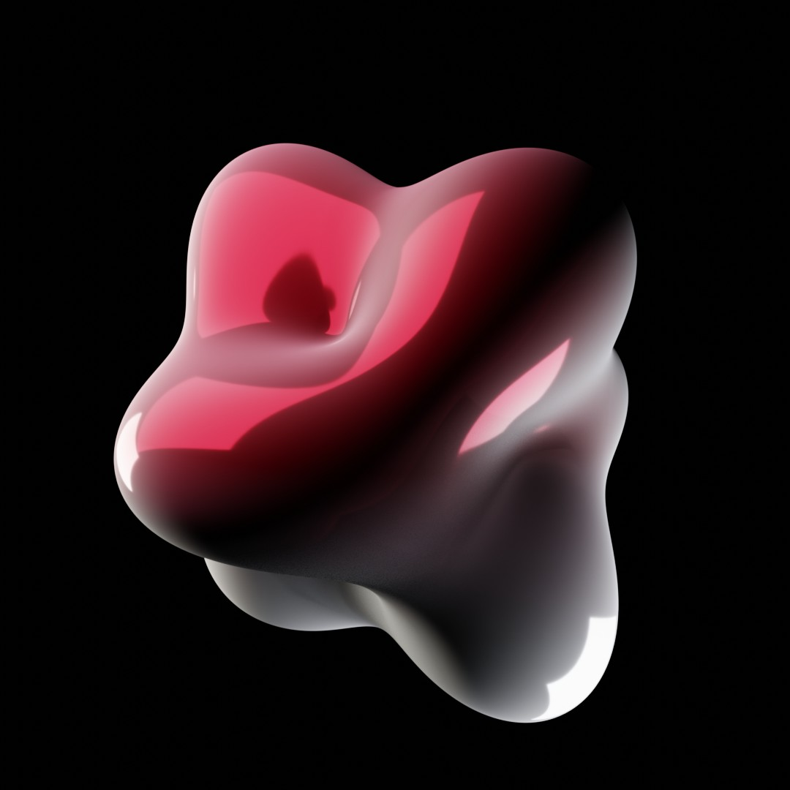
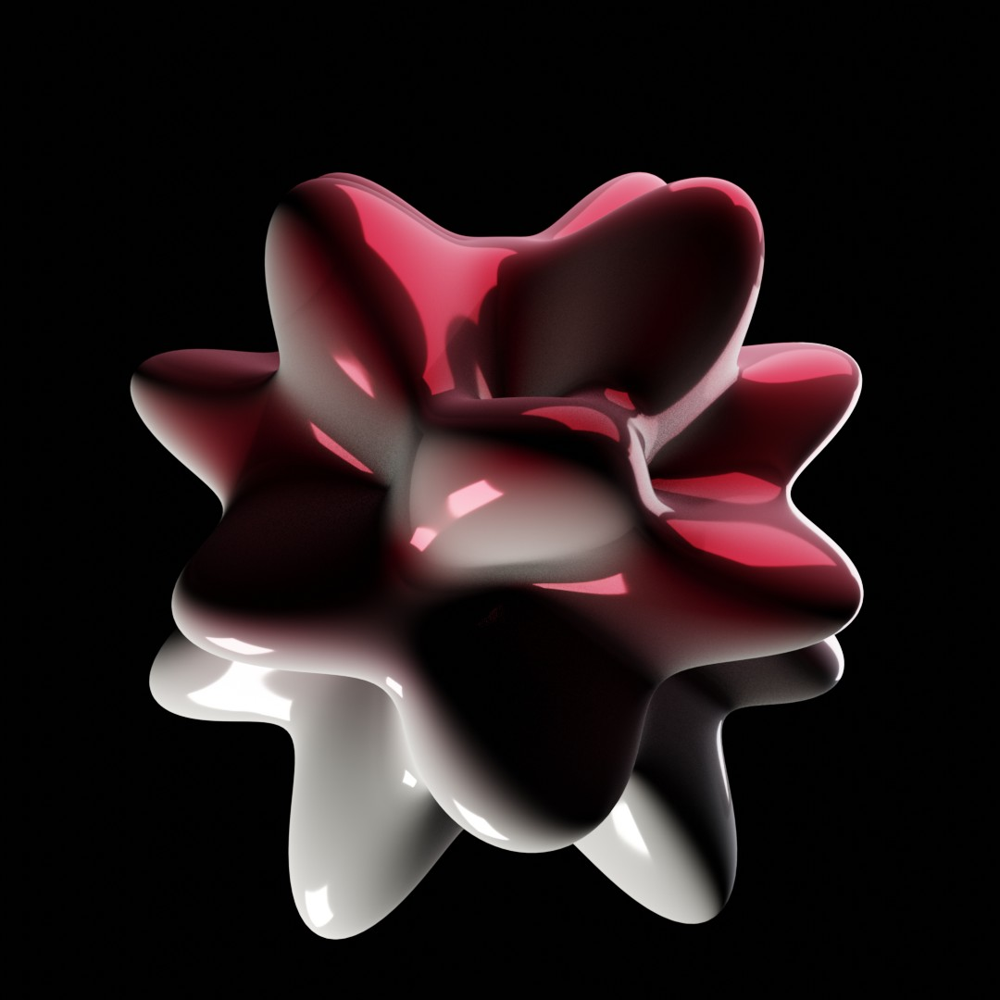

# Project Overview: Spherical harmonics Generator
The Artist description, imagine blowing on a soap bubble until it starts to ripple — not randomly, but in perfectly balanced standing waves that wrap all the way around without ever clashing at the seams. That's a spherical harmonic. It's the sphere's natural way of vibrating, the same family of patterns you'd see on a struck bell or a drumhead sprinkled with sand, just lifted from a flat membrane onto a globe. The Strength slider is simply how hard the ripple pushes and pulls the surface — turn it up and gentle waves become deep canyons and sharp ridges; flip it negative and every bump becomes a dent.

# Screen Shot

## Quick Documentation
There a two script version of the Addon, one with a animation function, one without.

Panel fields (N-panel → Harmonics tab):

* Degree (L) / Order (M) — the l, m above. M gets silently clamped to L if you push it past.
* Resolution — grid density (verts per axis). Higher = smoother but slower, especially with Auto Update or Animate on.
* Base Radius — the undeformed sphere's size (the "1" in the formula).
* Strength — how strongly Y perturbs that base radius. Negative values just invert bumps ↔ dents.
* Scale — uniform scale applied at the very end.
* Auto Update — regenerates live as you drag any slider above.
 * Generate — one-shot manual rebuild (also what Auto Update calls internally).
* Animate on Frame Change — rebuilds the mesh every frame during playback/scrubbing/render, which is what makes keyframed parameters (e.g. Strength) actually animate the geometry.

## Previews
| Preview | Preview | Preview |
| :--- | :--- |:--- |
|  |  |  |
|  |  |  |

## Release Notes

### v1.0.0 (August 10, 2026)
- **Publishing**: First public upload of the Add-on.

## Blender

