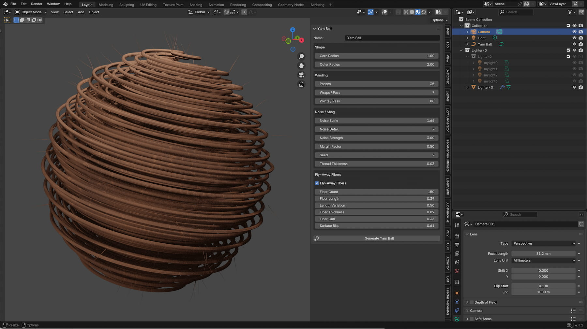
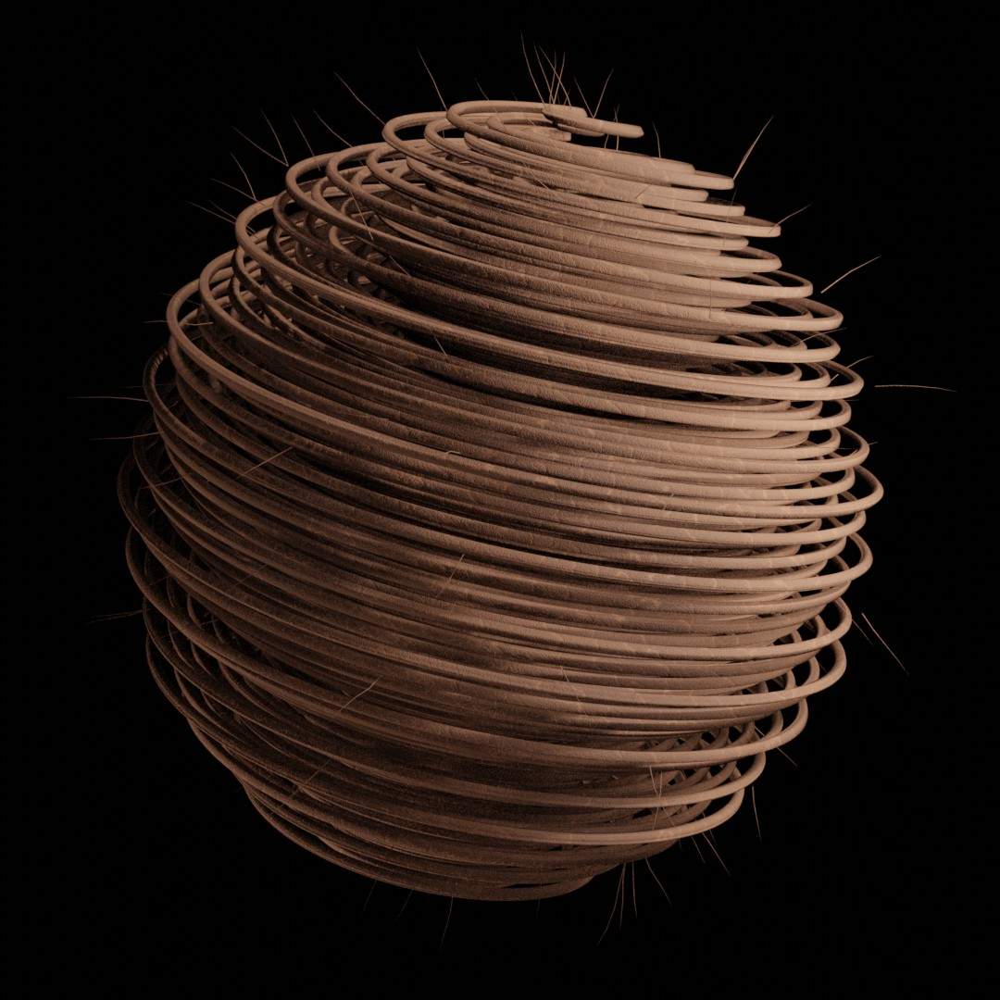
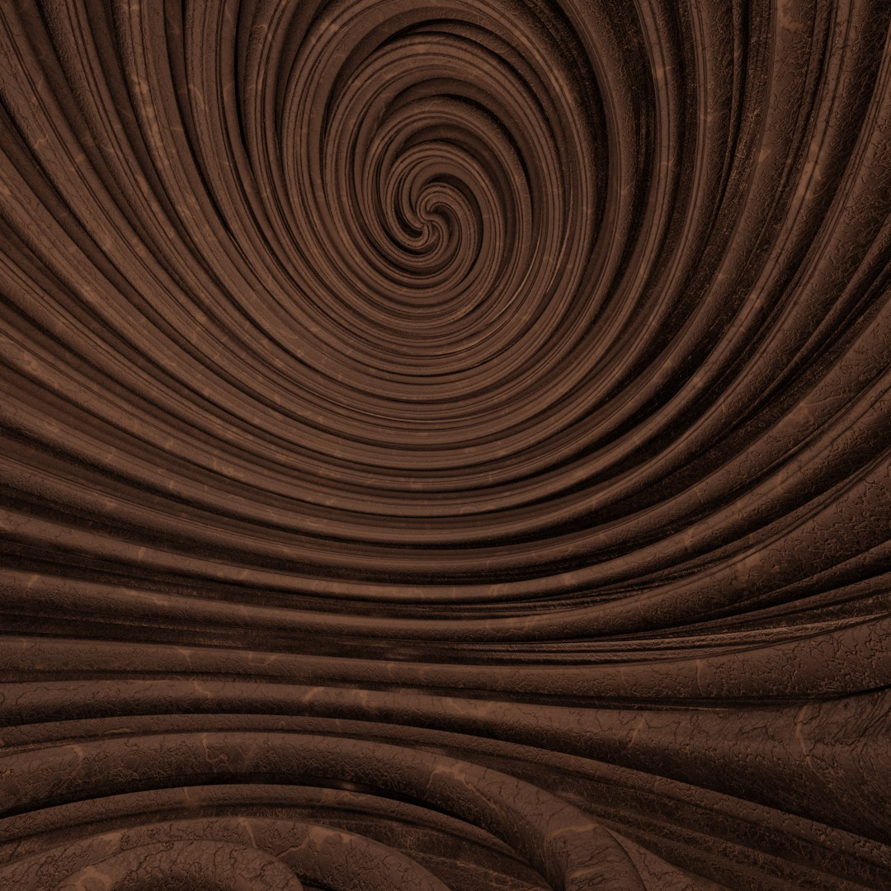
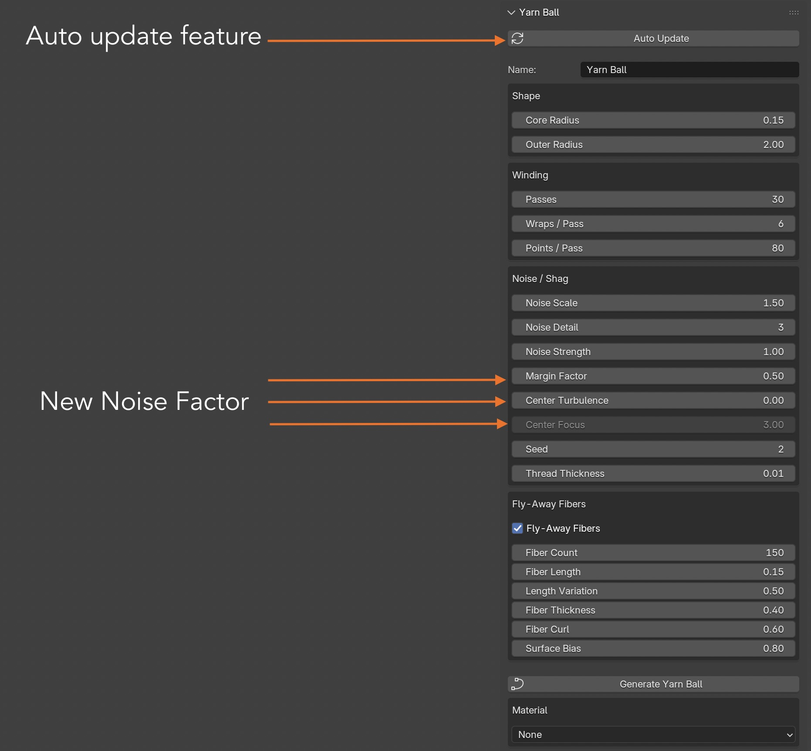

# Project Overview: Yarn Ball generator -- interactive add-on version
Generates a filled, non-self-intersecting yarn-ball curve with adjustable noise and fly-away fibers. Same non-self-intersecting winding scheme as before (monotonically growing radius across many pole-to-pole passes, golden-angle phase offset between passes), now wrapped as a small add-on.

# Key Features

* All parameters exposed as sliders in the 3D Viewport sidebar (press N, look for the "Yarn Ball" tab).
* A "Generate Yarn Ball" button that (re)builds the object in place -- no need to re-run or edit the script each time.
* An optional fly-away fiber pass: short, thin, tapered hair-like splines sprouting outward near the surface, for a genuinely fuzzy look on top of the main strand's organic wobble.
* Feedback via self.report(), which shows up in Blender's status bar and Info log -- no terminal/console needed.

# Screen Shot

## Install:
* Edit > Preferences > Add-ons > Install... and pick this file,
* then enable it. (Or just paste into the Scripting workspace and
* hit Run Script -- it registers itself for the current session.)

## Documentation
the Add-on is easy to understand. Just open the N-Panel and play with the settings

| Object | Preview |
| :--- | :--- |
|  |  |

# Screen Shot

## Release Notes

### v1.0.0 (July 29, 2026)
- **Publishing**: First public upload of the Add-on.

## Blender

